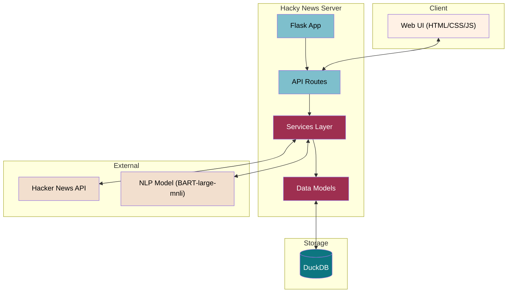

# Hacky News

A modern, categorized interface for Hacker News stories with analytics and search features.


## Features

- 📱 **Responsive UI** with a clean, modern design inspired by Financial Times
- 🔍 **Automatic categorization** of news stories using NLP
- 📊 **Analytics dashboard** with category distribution and top stories
- 🔎 **Fast search** with autocomplete suggestions
- 🌙 **Dark mode** support
- 🔄 **Background updates** every 15 minutes
- 📂 **Category filtering** with organized primary and secondary categories

## Architecture

The application follows a modern Flask architecture with a clear separation of concerns:



## Tech Stack

- **Frontend**: HTML5, CSS3, JavaScript (Vanilla)
- **Backend**: Python, Flask
- **Database**: DuckDB (embedded database)
- **Charting**: Chart.js
- **Style**: Bootstrap Icons
- **NLP**: BART-large-mnli model via Hugging Face

## Setup & Installation

### Prerequisites

- Python 3.9+
- Node.js and npm (for frontend dependencies)

### Quick Start

1. Clone the repository:

```bash
git clone https://github.com/yourusername/hacky-news.git
cd hacky-news
```

2. Set up the environment:

```bash
# Using the setup script (recommended)
./install.sh

# Or manually
python -m venv venv
source venv/bin/activate  # On Windows: venv\Scripts\activate
pip install -r requirements.txt
```

3. Run the application:

```bash
python server.py
```

4. Open your browser and navigate to `http://localhost:5000`

### Docker Deployment

You can also run Hacky News using Docker:

```bash
docker-compose up -d
```

## API Documentation

The application provides a RESTful API for accessing Hacker News data:

### News Endpoints

- `GET /news` - Get latest news stories
  - Query parameters:
    - `category` (optional): Filter by category
    - `limit` (optional): Limit number of results (default: 30)

- `GET /search` - Search for news stories
  - Query parameters:
    - `q`: Search query (required)
    - `category` (optional): Filter by category
    - `limit` (optional): Limit number of results (default: 50)

- `GET /autocomplete` - Get autocomplete suggestions
  - Query parameters:
    - `q`: Prefix to search for (required)
    - `limit` (optional): Limit number of results (default: 7)

### Category and Stats Endpoints

- `GET /categories` - Get all available categories and their counts
- `GET /stats` - Get basic stats about the database
- `GET /stats/top-recent` - Get top stories by points, sorted by recent date
- `GET /stats/top-alltime` - Get top stories by points of all time

### System Endpoints

- `GET /update` - Manually update news data from Hacker News API
  - Query parameters:
    - `limit` (optional): Limit number of stories to process (default: 50)

## Example API Usage

### Fetch Latest News

```javascript
fetch('/news')
  .then(response => response.json())
  .then(data => console.log(data));
```

### Search for Stories

```javascript
fetch('/search?q=python&category=Programming')
  .then(response => response.json())
  .then(data => console.log(data));
```

### Get Category Distribution

```javascript
fetch('/stats')
  .then(response => response.json())
  .then(data => {
    console.log(`Total stories: ${data.total_stories}`);
    data.categories.forEach(cat => {
      console.log(`${cat.name}: ${cat.count} stories`);
    });
  });
```

## Configuration

Configuration options are stored in `app/config/settings.py`:

- `DEBUG`: Enable/disable debug mode
- `PORT`: Server port (default: 5000)
- `HOST`: Server host (default: '0.0.0.0')
- `DB_FILE`: DuckDB database file path
- `DEFAULT_DISPLAY_LIMIT`: Default number of stories to display

## Contributing

Contributions are welcome! Please feel free to submit a Pull Request.

1. Fork the repository
2. Create your feature branch (`git checkout -b feature/amazing-feature`)
3. Commit your changes (`git commit -m 'Add some amazing feature'`)
4. Push to the branch (`git push origin feature/amazing-feature`)
5. Open a Pull Request

## License

This project is licensed under the MIT License - see the LICENSE file for details.

## Acknowledgements

- [Hacker News API](https://github.com/HackerNews/API)
- [Hugging Face Transformers](https://huggingface.co/facebook/bart-large-mnli)
- [DuckDB](https://duckdb.org/)
- [Flask](https://flask.palletsprojects.com/)
- [Chart.js](https://www.chartjs.org/)
- [Bootstrap Icons](https://icons.getbootstrap.com/)
